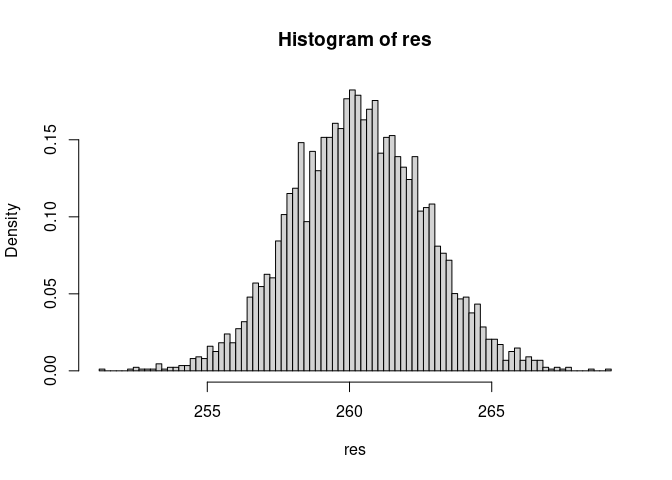

Central Limit Theorem
================
Alex K
3/21/2021

``` r
normality_test <- function(res_orig, res) {
res_normalized <- (res - mean(res)) / sd(res)
hist(res_orig, breaks = 100, probability = TRUE)
hist(res, breaks = 100, probability = TRUE)

library(EnvStats)
library(nortest)
qqPlot(res, add.line = TRUE, line.col = "red")
plot(ecdf(res_normalized),  
     xlim = range(c(res_normalized, rnorm(length(res_mean)))),  
     col = "blue") 
plot(ecdf(rnorm(trials)), add = TRUE, lty = "dashed", col = "red") 
  
if (length(res) <= 5000) {
  p_value <- shapiro.test(res)$p.value
  print(paste0("p-value from Shapiro-Wilk test:", p_value))
  # null-hypothesis of shapiro test: the population is normally distributed
  # If the p-value is less than 0.05, we reject the null hypothesis
} else {
  print("Shapiro-Wilk test is skipped since res has more than 5000 elements")
}
p_value <- stats::ks.test(x = res_normalized, y = rnorm(length(res_mean)))$p.value
print(paste0("p-value from KS test:", p_value))
p_value <- ad.test(res_mean)$p.value
print(paste0("p-value from AD test:", p_value))

}
```

## 1st simulation: quite a few consecutively numbered balls

``` r
set.seed(202103)
max_num <- 123
balls <- c(1:max_num)
trials <- 3873
draw_per_trial <- 637

draw <- matrix(sample(1:max_num, trials * draw_per_trial, replace = TRUE), nrow=trials)
#draw

draw_res <- matrix(balls[draw], nrow=trials)
#draw_res

res_mean <- rowMeans(draw_res)
normality_test(draw_res[,1], res_mean)
```

<!-- --><!-- --><!-- -->

    ## [1] "p-value from Shapiro-Wilk test:0.936986384372212"

    ## Warning in stats::ks.test(x = res_normalized, y = rnorm(length(res_mean))): p-
    ## value will be approximate in the presence of ties

<!-- -->

    ## [1] "p-value from KS test:0.927376890499923"
    ## [1] "p-value from AD test:0.697080240806543"

## 2st simulation: only 2 balls

``` r
set.seed(202103)
max_num <- 2
balls <- c(1:max_num)
trials <- 2458
draw_per_trial <- 3732

draw <- matrix(sample(1:max_num, trials * draw_per_trial, replace = TRUE), nrow=trials)
#draw
draw_res <- matrix(balls[draw], nrow=trials)
#draw_res

res_mean <- rowMeans(draw_res)
normality_test(draw_res[,1], res_mean)
```

<!-- --><!-- --><!-- -->

    ## [1] "p-value from Shapiro-Wilk test:0.529309133203639"

    ## Warning in stats::ks.test(x = res_normalized, y = rnorm(length(res_mean))): p-
    ## value will be approximate in the presence of ties

<!-- -->

    ## [1] "p-value from KS test:0.228464594066885"
    ## [1] "p-value from AD test:0.421579010367216"

## 3rd simulation: a really odd distribution

``` r
set.seed(202103)

balls <- c(1, 1, 3, 7, 123, 666, 233, 996, 997, log(2), log(3), 3.14159, exp(1),
           log(2147483648), log(2147483648), log(2147483648), log(2147483648),
           log(2147483648), log(3838438), 1024, 555, 233, 233, 233, 666, 666)
max_num <- length(balls)
trials <- 4387
draw_per_trial <- 23333

draw <- matrix(sample(1:max_num, trials * draw_per_trial, replace = TRUE), nrow=trials)
#draw
draw_res <- matrix(balls[draw], nrow=trials)
#draw_res

res_mean <- rowMeans(draw_res)
normality_test(draw_res[,1], res_mean)
```

<!-- --><!-- --><!-- --><!-- -->

    ## [1] "p-value from Shapiro-Wilk test:0.786503309643557"
    ## [1] "p-value from KS test:0.975112171197316"
    ## [1] "p-value from AD test:0.580284697194215"

## 4th simulation: exponential distribution

``` r
trials <- 4999
max_num <- 4999 * 4999

draw_res <- matrix(rexp(n = max_num), nrow=trials)
#draw_res

res_mean <- rowMeans(draw_res)
normality_test(draw_res[,1], res_mean)
```

<!-- --><!-- --><!-- --><!-- -->

    ## [1] "p-value from Shapiro-Wilk test:0.234639021782301"
    ## [1] "p-value from KS test:0.365599021873269"
    ## [1] "p-value from AD test:0.514977567531255"
