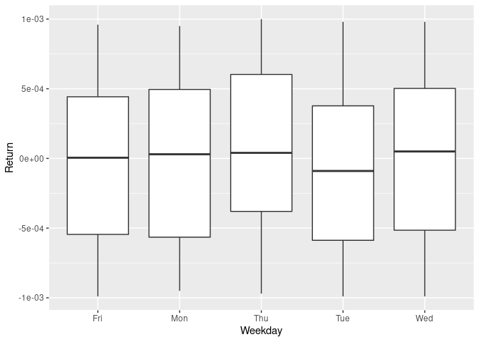

T-Test and ANOVA
================
Alex Kong
2/22/2021

### Page 11

-   Generate a random sample of 10 numbers from a normal distribution
    with mean 0 and standard deviation 2. Then use t.test to test the
    null hypothesis that the mean is 0.

$$
H\_0: \\mu == 0 \\\\
H\_1: \\mu \\neq 0
$$

``` r
s1 <- rnorm(10, mean=0, sd=2)
# Note that t test can only be used under the normal distribution assumption!
res <- t.test(s1)
res$p.value
```

    ## [1] 0.4937619

``` r
res$conf.int
```

    ## [1] -1.2905391  0.6718077
    ## attr(,"conf.level")
    ## [1] 0.95

``` r
t.test(rnorm(3000, mean=0, sd=2))
```

    ## 
    ##  One Sample t-test
    ## 
    ## data:  rnorm(3000, mean = 0, sd = 2)
    ## t = 1.3034, df = 2999, p-value = 0.1925
    ## alternative hypothesis: true mean is not equal to 0
    ## 95 percent confidence interval:
    ##  -0.02395696  0.11895645
    ## sample estimates:
    ##  mean of x 
    ## 0.04749975

-   Generate a random sample of 10 numbers from a normal distribution
    with mean 1.5 and standard deviation 2. Then use t.test to test the
    null hypothesis that the mean is 0.

``` r
s1 <- rnorm(10, mean=1.5, sd=2)
# Note that t test can only be used under the normal distribution assumption!
res <- t.test(s1)
res$p.value
```

    ## [1] 0.0731685

``` r
res$conf.int
```

    ## [1] -0.1879967  3.4446791
    ## attr(,"conf.level")
    ## [1] 0.95

``` r
res$estimate
```

    ## mean of x 
    ##  1.628341

### Page 13


``` r
csv <- read.csv(file = 'example.csv')
csv <- as_tibble(csv)
csv
```

    ## # A tibble: 20 x 3
    ##    Time.Order Method Yield
    ##         <int> <chr>  <dbl>
    ##  1          1 A       89.7
    ##  2          2 A       81.4
    ##  3          3 A       84.5
    ##  4          4 A       84.8
    ##  5          5 A       87.3
    ##  6          6 A       79.7
    ##  7          7 A       85.1
    ##  8          8 A       81.7
    ##  9          9 A       83.7
    ## 10         10 A       84.5
    ## 11         11 B       84.7
    ## 12         12 B       86.1
    ## 13         13 B       83.2
    ## 14         14 B       91.9
    ## 15         15 B       86.3
    ## 16         16 B       79.3
    ## 17         17 B       82.6
    ## 18         18 B       89.1
    ## 19         19 B       83.7
    ## 20         20 B       88.5

``` r
a <- csv %>% filter(Method == 'A')
b <- csv %>% filter(Method == 'B')
a$Yield
```

    ##  [1] 89.7 81.4 84.5 84.8 87.3 79.7 85.1 81.7 83.7 84.5

``` r
t.test(a$Yield, b$Yield)
```

    ## 
    ##  Welch Two Sample t-test
    ## 
    ## data:  a$Yield and b$Yield
    ## t = -0.88158, df = 17.129, p-value = 0.3902
    ## alternative hypothesis: true difference in means is not equal to 0
    ## 95 percent confidence interval:
    ##  -4.409417  1.809417
    ## sample estimates:
    ## mean of x mean of y 
    ##     84.24     85.54

### Page 16

``` r
prop.test(c(13883, 11930), c(13883+79658, 11930 + 110348))
```

    ## 
    ##  2-sample test for equality of proportions with continuity correction
    ## 
    ## data:  c(13883, 11930) out of c(13883 + 79658, 11930 + 110348)
    ## X-squared = 1301, df = 1, p-value < 2.2e-16
    ## alternative hypothesis: two.sided
    ## 95 percent confidence interval:
    ##  0.04802148 0.05368179
    ## sample estimates:
    ##     prop 1     prop 2 
    ## 0.14841620 0.09756457

``` r
#X-squared is just chi-square
sqrt(1301)
```

    ## [1] 36.06938

### Page 17

Note that ANOVA is a way to estimate means.

``` r
csv %>% ggplot(aes(x = Method, y = Yield)) + geom_boxplot()
```

<!-- -->

``` r
res <- aov(Yield ~ Method, data=csv)
res
```

    ## Call:
    ##    aov(formula = Yield ~ Method, data = csv)
    ## 
    ## Terms:
    ##                  Method Residuals
    ## Sum of Squares    8.450   195.708
    ## Deg. of Freedom       1        18
    ## 
    ## Residual standard error: 3.297373
    ## Estimated effects may be unbalanced

``` r
summary(res)
```

    ##             Df Sum Sq Mean Sq F value Pr(>F)
    ## Method       1   8.45    8.45   0.777   0.39
    ## Residuals   18 195.71   10.87

``` r
summary.lm(res)
```

    ## 
    ## Call:
    ## aov(formula = Yield ~ Method, data = csv)
    ## 
    ## Residuals:
    ##    Min     1Q Median     3Q    Max 
    ## -6.240 -2.390  0.260  1.385  6.360 
    ## 
    ## Coefficients:
    ##             Estimate Std. Error t value Pr(>|t|)    
    ## (Intercept)   84.240      1.043  80.789   <2e-16 ***
    ## MethodB        1.300      1.475   0.882     0.39    
    ## ---
    ## Signif. codes:  0 '***' 0.001 '**' 0.01 '*' 0.05 '.' 0.1 ' ' 1
    ## 
    ## Residual standard error: 3.297 on 18 degrees of freedom
    ## Multiple R-squared:  0.04139,    Adjusted R-squared:  -0.01187 
    ## F-statistic: 0.7772 on 1 and 18 DF,  p-value: 0.3896

``` r
res$coefficients
```

    ## (Intercept)     MethodB 
    ##       84.24        1.30

``` r
# intercept is the mean of A, A plus MethodB is the mean of B
```

### Another ANOVA practice

``` r
dA <- readr::read_csv('exchangeA.csv')
```

    ## 
    ## ── Column specification ────────────────────────────────────────────────────────
    ## cols(
    ##   Mon = col_double(),
    ##   Tue = col_double(),
    ##   Wed = col_double(),
    ##   Thu = col_double(),
    ##   Fri = col_double()
    ## )

``` r
dB <- readr::read_csv('exchangeB.csv')
```

    ## 
    ## ── Column specification ────────────────────────────────────────────────────────
    ## cols(
    ##   Mon = col_double(),
    ##   Tue = col_double(),
    ##   Wed = col_double(),
    ##   Thu = col_double(),
    ##   Fri = col_double()
    ## )

``` r
d <- bind_rows(dA %>% add_column(Exchange="A"), dB %>% add_column(Exchange="B"))
d
```

    ## # A tibble: 100 x 6
    ##         Mon       Tue      Wed       Thu       Fri Exchange
    ##       <dbl>     <dbl>    <dbl>     <dbl>     <dbl> <chr>   
    ##  1 -0.00068 -0.00091  -0.00076 -0.00035   0.00006  A       
    ##  2  0.00006 -0.00035   0.00046  0.00059   0.00044  A       
    ##  3 -0.00004  0.00048  -0.0004  -0.00002   0.00062  A       
    ##  4  0.00031 -0.000280  0.00087 -0.00048   0.000140 A       
    ##  5 -0.00092  0.00035   0.00081 -0.00054  -0.00094  A       
    ##  6 -0.00086  0.00083  -0.0004  -0.00035  -0.000140 A       
    ##  7 -0.00087  0.0008    0.00044  0.00053   0.00009  A       
    ##  8  0.00062 -0.00008   0.0005  -0.000150  0.00071  A       
    ##  9  0.00002  0.0008   -0.00068  0.00046   0.0004   A       
    ## 10 -0.00095  0.000130 -0.00059  0.00033   0.0001   A       
    ## # … with 90 more rows

``` r
d_long <- d %>% pivot_longer(Mon:Fri, names_to="Weekday", values_to="Return")
d_long
```

    ## # A tibble: 500 x 3
    ##    Exchange Weekday   Return
    ##    <chr>    <chr>      <dbl>
    ##  1 A        Mon     -0.00068
    ##  2 A        Tue     -0.00091
    ##  3 A        Wed     -0.00076
    ##  4 A        Thu     -0.00035
    ##  5 A        Fri      0.00006
    ##  6 A        Mon      0.00006
    ##  7 A        Tue     -0.00035
    ##  8 A        Wed      0.00046
    ##  9 A        Thu      0.00059
    ## 10 A        Fri      0.00044
    ## # … with 490 more rows

``` r
res <- aov(Return ~ Weekday + Exchange, data=d_long)
summary(res)
```

    ##              Df   Sum Sq   Mean Sq F value Pr(>F)  
    ## Weekday       4 8.80e-07 2.202e-07   0.648 0.6288  
    ## Exchange      1 1.03e-06 1.027e-06   3.020 0.0829 .
    ## Residuals   494 1.68e-04 3.401e-07                 
    ## ---
    ## Signif. codes:  0 '***' 0.001 '**' 0.01 '*' 0.05 '.' 0.1 ' ' 1

``` r
summary.lm(res)
```

    ## 
    ## Call:
    ## aov(formula = Return ~ Weekday + Exchange, data = d_long)
    ## 
    ## Residuals:
    ##        Min         1Q     Median         3Q        Max 
    ## -0.0010363 -0.0004928  0.0000080  0.0004899  0.0010901 
    ## 
    ## Coefficients:
    ##               Estimate Std. Error t value Pr(>|t|)  
    ## (Intercept)  1.592e-05  6.388e-05   0.249   0.8033  
    ## WeekdayMon   3.610e-05  8.247e-05   0.438   0.6618  
    ## WeekdayThu   9.040e-05  8.247e-05   1.096   0.2736  
    ## WeekdayTue  -3.540e-05  8.247e-05  -0.429   0.6679  
    ## WeekdayWed   3.670e-05  8.247e-05   0.445   0.6565  
    ## ExchangeB   -9.064e-05  5.216e-05  -1.738   0.0829 .
    ## ---
    ## Signif. codes:  0 '***' 0.001 '**' 0.01 '*' 0.05 '.' 0.1 ' ' 1
    ## 
    ## Residual standard error: 0.0005832 on 494 degrees of freedom
    ## Multiple R-squared:  0.01123,    Adjusted R-squared:  0.001221 
    ## F-statistic: 1.122 on 5 and 494 DF,  p-value: 0.3476

``` r
new <- tibble(Exchange="A", Weekday="Wed")
predict(res, new, interval="prediction", level=0.99, se.fit = TRUE)
```

    ## $fit
    ##         fit          lwr         upr
    ## 1 5.262e-05 -0.001464347 0.001569587
    ## 
    ## $se.fit
    ## [1] 6.388199e-05
    ## 
    ## $df
    ## [1] 494
    ## 
    ## $residual.scale
    ## [1] 0.0005831601

``` r
d_long
```

    ## # A tibble: 500 x 3
    ##    Exchange Weekday   Return
    ##    <chr>    <chr>      <dbl>
    ##  1 A        Mon     -0.00068
    ##  2 A        Tue     -0.00091
    ##  3 A        Wed     -0.00076
    ##  4 A        Thu     -0.00035
    ##  5 A        Fri      0.00006
    ##  6 A        Mon      0.00006
    ##  7 A        Tue     -0.00035
    ##  8 A        Wed      0.00046
    ##  9 A        Thu      0.00059
    ## 10 A        Fri      0.00044
    ## # … with 490 more rows

``` r
res2 <- aov(Return ~ Weekday, data=d_long)
summary(res2)
```

    ##              Df   Sum Sq   Mean Sq F value Pr(>F)
    ## Weekday       4 8.80e-07 2.202e-07   0.645  0.631
    ## Residuals   495 1.69e-04 3.415e-07

``` r
summary.lm(res2)
```

    ## 
    ## Call:
    ## aov(formula = Return ~ Weekday, data = d_long)
    ## 
    ## Residuals:
    ##        Min         1Q     Median         3Q        Max 
    ## -1.031e-03 -5.196e-04  1.115e-05  5.028e-04  1.045e-03 
    ## 
    ## Coefficients:
    ##               Estimate Std. Error t value Pr(>|t|)
    ## (Intercept) -2.940e-05  5.843e-05  -0.503    0.615
    ## WeekdayMon   3.610e-05  8.264e-05   0.437    0.662
    ## WeekdayThu   9.040e-05  8.264e-05   1.094    0.275
    ## WeekdayTue  -3.540e-05  8.264e-05  -0.428    0.669
    ## WeekdayWed   3.670e-05  8.264e-05   0.444    0.657
    ## 
    ## Residual standard error: 0.0005843 on 495 degrees of freedom
    ## Multiple R-squared:  0.005185,   Adjusted R-squared:  -0.002854 
    ## F-statistic: 0.6449 on 4 and 495 DF,  p-value: 0.6307

``` r
predict(res2, new, interval="prediction", level=0.99, se.fit = TRUE)
```

    ## $fit
    ##       fit          lwr         upr
    ## 1 7.3e-06 -0.001511244 0.001525844
    ## 
    ## $se.fit
    ## [1] 5.843486e-05
    ## 
    ## $df
    ## [1] 495
    ## 
    ## $residual.scale
    ## [1] 0.0005843486

``` r
d_long %>% group_by(Exchange) %>% ggplot(aes(x=Exchange, y=Return)) +
geom_boxplot()
```

<!-- -->

``` r
d_long %>% group_by(Weekday) %>% ggplot(aes(x=Weekday, y=Return)) +
geom_boxplot()
```

<!-- -->
\`\`\`
